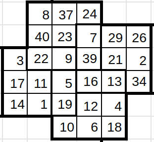

# Jane Street April 2022 problem solution
## Explanation
Problem is to find 28 distinct numbers such that when we put them in the given shape, they squares presnet inside shape are almost magic and the sum is minimum.

As it is said in problem there are 4 almost magic squares in the shape. Let's split them in 4 different squares.
Now the problem becomes:
1. We have to make 4 almost magic squares.
2. Shen we combine them and make the required shape for answer, the overlapping elements among squares are same, except overlapping elements all elements should be distinct and total sum should be minimum.

To solve this our approach is.
1. First create all possible almost magic squares. Code for this part is written in am_squares.cpp it outputs all possible almost magic squares in output.txt.
2. Using the possible almost squares, find the shape with minimum sum. Code for this part is written in solution.cpp.

Both code are multithreaded using openmp library so that program execution takes less time.

## Code Execution:
### First part:
```
cd april
g++ am_squares.cpp -O3 -fopenmp -o am_squares
./am_squares
```
### Second part:
Execute this only after first part execution completes.
```
g++ solution.cpp -O3 -fopenmp -o solution
./solution
```

Now it will give you solution something like:
```
7 29 26 
39 21 2 
16 13 34 

13 4 18 
16 12 6 
5 19 10 

19 1 14 
5 11 17 
9 22 3 

22 40 8 
9 23 37 
39 7 24 
```
To construct answer shape from it.
* First put 1st 3\*3 square in right most square in answer shape.
* Rotate 2nd 3\*3 square 90 clockwise, then put into clockwise next square in answer shape.
* Rotate 3nd 3\*3 square 180 clockwise, then put into clockwise next square in answer shape.
* Rotate 4nd 3\*3 square 270 clockwise, then put into clockwise next square in answer shape.

And you will get the answer shape as:


